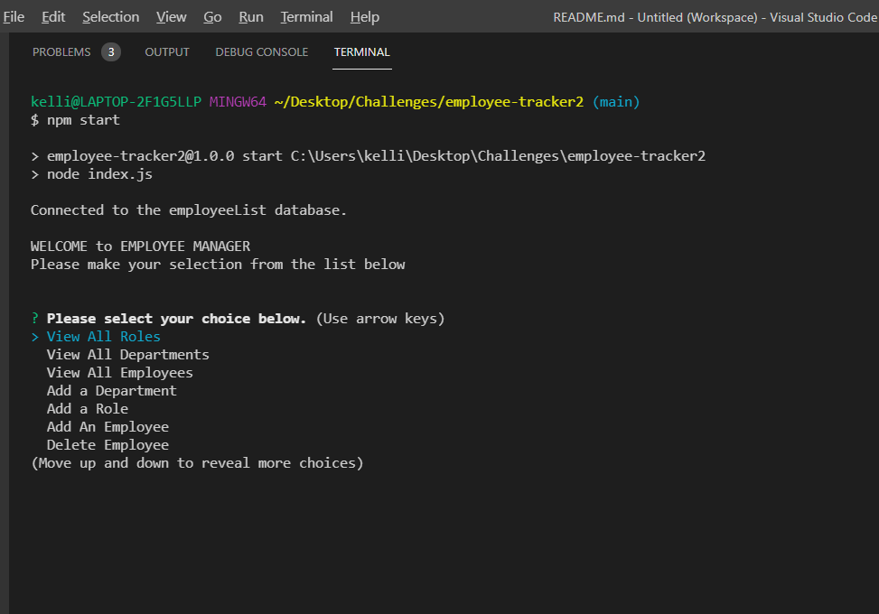
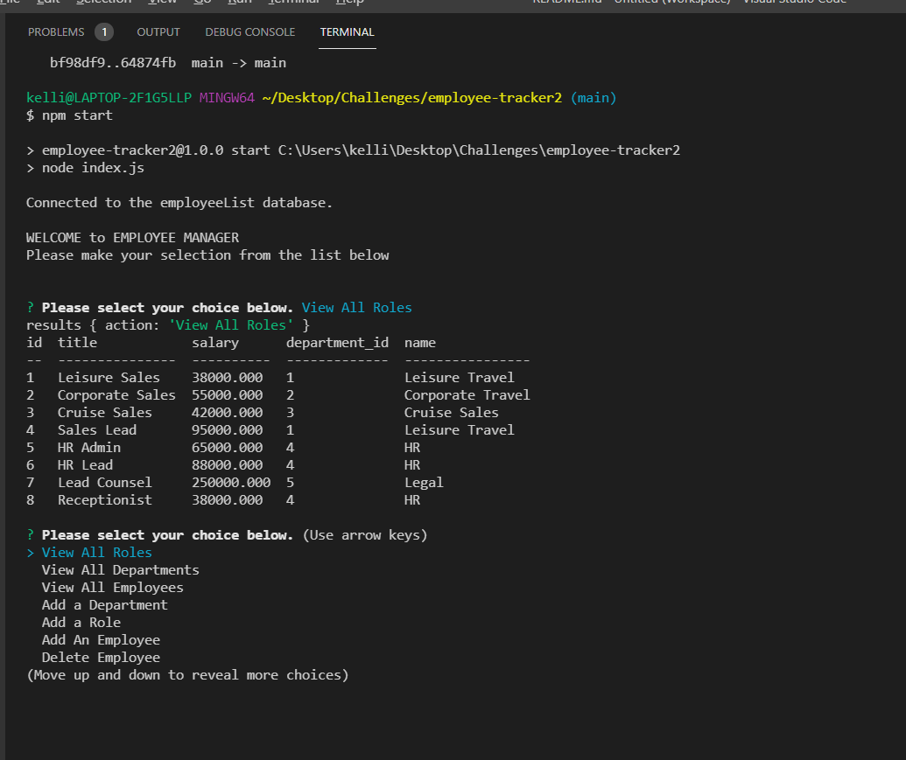
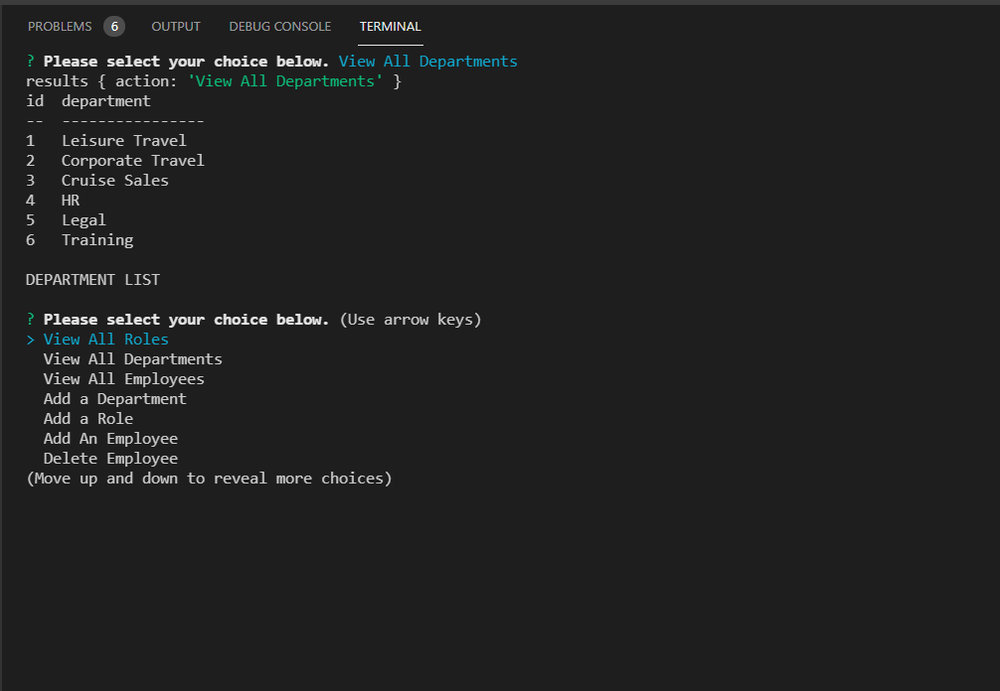
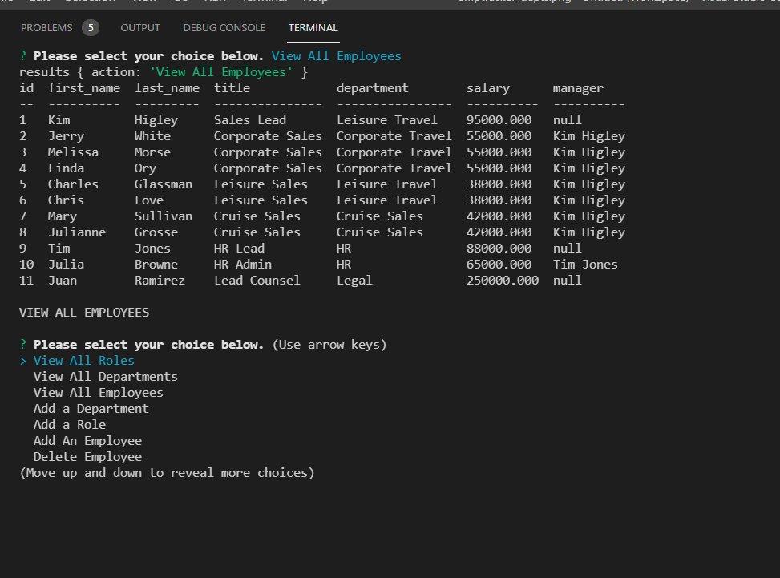

## Employee Tracker 

## Purpose
A CLI application that is used to create and maintain a employee database.  Tables include:  employees, roles, and departments.

## Built With
* JavaScript
* MySQL
* Node
* inquirer
* console.table

## Link to walk thru video of application
https://drive.google.com/file/d/1dXkATVYjoD1AKtiDl7Wqa2etJrwvnq7G/view

## Screenshots of tests

## Contribution
Created by Kellie Werrell :star: